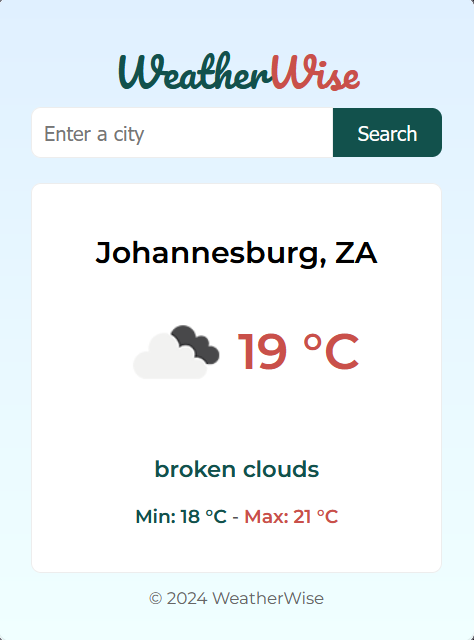

## WeatherWise Browser Extension

WeatherWise is a simple and elegant browser extension that provides current weather information for a given city. With a clean interface and easy-to-use features, WeatherWise helps you stay updated on the weather conditions without leaving your browser.

### Features

- **Current Weather:** View the current weather details including temperature, description, and icon for a specified city.
- **Search Functionality:** Easily search for weather information by entering the city name.
- **Geolocation Support:** Retrieve the current weather based on your device's location.
- **Responsive Design:** The extension is designed to be responsive and user-friendly on various screen sizes.

### Installation

1. Clone the repository to your local machine:

   ```bash
   git clone https://github.com/ssalidm/weatherwise-browser-extension.git

1. Open your browser and navigate to the Extensions or Add-ons page.
2. Enable Developer Mode.
3. Click on "Load Unpacked" or a similar option.
4. Select the folder where you cloned the repository.
5. The WeatherWise extension should now be installed and visible in your browser.

## Usage
1. Open a new tab or window in your browser.
2. Locate the WeatherWise extension icon.
3. Click on the icon to open the WeatherWise interface.
4. Enter the name of the city you want to check the weather for.
5. Press the "Search" button.
6. View the current weather information for the specified city.

## Screenshots



## Contributing
If you want to contribute to WeatherWise, feel free to submit issues or pull requests. We welcome any improvements or bug fixes.

## Credits
WeatherWise is developed and maintained by David Ssali.

## License
This project is licensed under the MIT License - see the LICENSE file for details.

## Acknowledgments
Weather data provided by OpenWeather.
